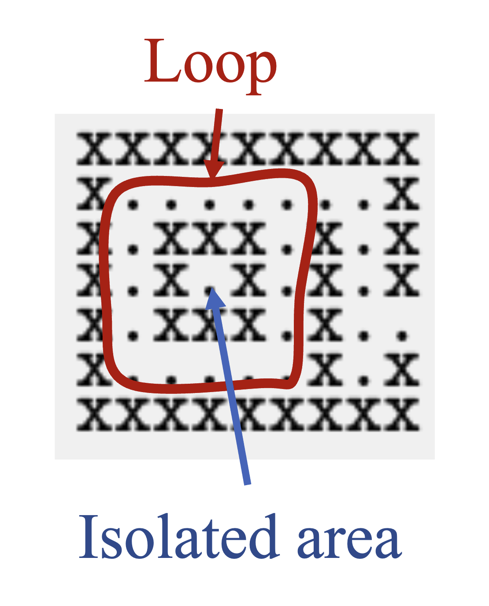

# Imperfect Mazes & Validation

A **perfect maze** has exactly one path between any two cells: no isolated pockets and no loops. The diagram below shows both failure modes:

  

*Red outline: a **loop** — a wall region disconnected from the outer boundary, creating a cycle in the passage network. Blue arrow: an **isolated area** — open cells completely unreachable from the entrance.*

**`maze-gen --validate`** reads an ASCII maze from `stdin` and checks whether it is a valid perfect maze, printing exactly `VALID` or `INVALID` to `stderr`. It does not modify the maze.

## Hints

**Isolation:** Start with a copy of the maze, then flood-fill the passage at the entrance. Scan the maze — preferably in a random order that still hits every possible cell — for any unfilled open cells. If any exist, the maze contains isolated areas and is invalid.

**Loops:** The approach is almost identical, but treat walls as passages and vice versa. Start with a copy of the maze, then flood-fill across the outer wall (starting from any corner). Scan the maze — preferably in a random order that still hits every possible wall cell — for any unfilled wall cells. If any exist, that wall region is disconnected from the outer boundary, indicating a loop in the passage network, and the maze is invalid.
