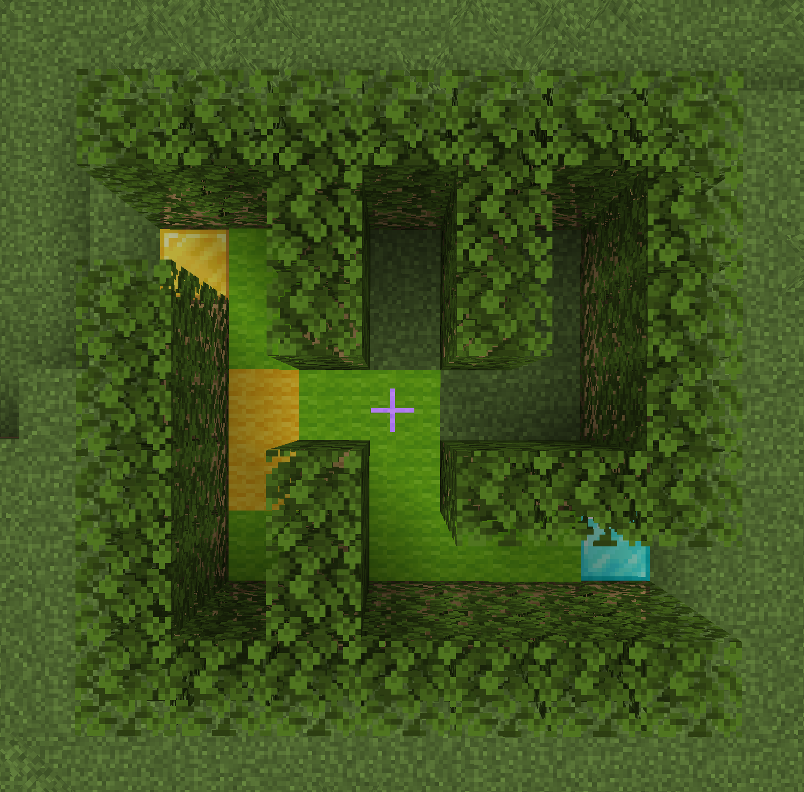

# A Solved Maze Example

Below is a 7×7 maze (seed 99) before and after solving with `--alg right` (Right-Hand Rule). The digits on the solved grid indicate how many times the solver visited each cell:

<table><tr><th>Unsolved (<code>./maze-gen 7 7 99</code>)</th><th>Solved (<code>./maze-gen 7 7 99 | ./maze-solve --alg right</code>)</th></tr>
<tr><td>

```text
XXXXXXX
S X X X
X X X X
X     X
X X XXX
X X   E
XXXXXXX
```

</td><td>

```text
XXXXXXX
S1X X X
X1X X X
X211  X
X2X1XXX
X1X111E
XXXXXXX
```

</td></tr></table>

Cells marked `1` were visited exactly once (the direct path to the exit). Cells marked `2` were visited twice — the solver passed through them, hit a dead end, and backtracked. `maze-view` uses these frequency counts to colour the floor of the Minecraft render, so heavily backtracked cells appear in a distinct colour.

The Minecraft render of the same maze (seed 99, solved with `--alg right`, visualised with `maze-view`):

<p align="center">
  
</p>
